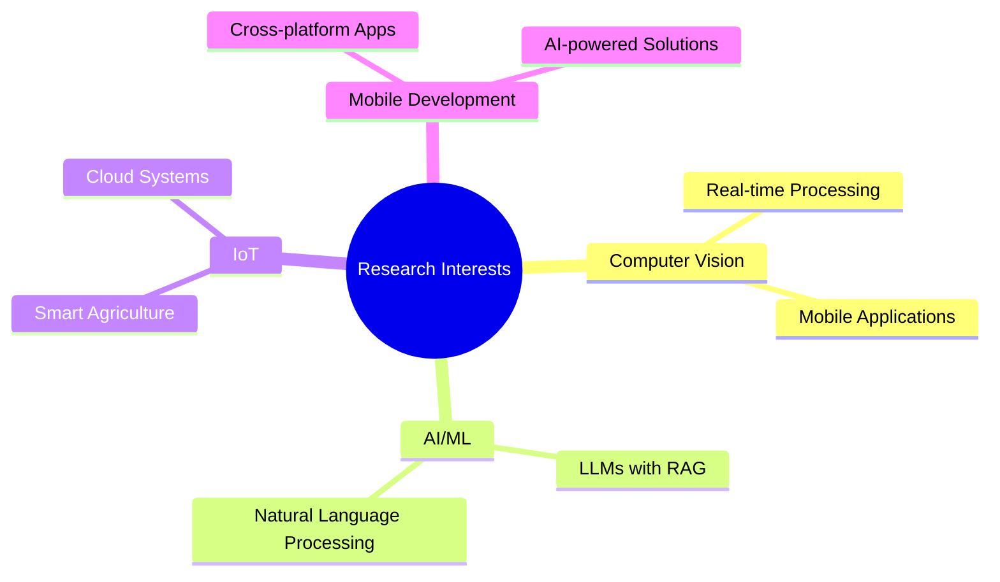

#  Hi there, I'm Shakib Howlader

  

  
  

---

## 🚀 About Me

🎓 **Final-year Computer Science & Engineering student** at Daffodil International University (DIU)

💡 **Passionate about** software development, AI/ML, computer vision, and problem-solving

📱 **Currently focused on** Flutter, Firebase, AI-powered apps, and system design

📖 **Exploring research in** Real-Time Sign Language Translation and trending LLM/NLP + RAG topics

⚡ **Founder of BitStream** – my first startup journey

 

---

## 🛠️ Tech Stack & Skills

### 💻 Programming Languages

  
  
  
  
  
  
  

### 📱 App & Web Development

  
  
  
  

### 📊 Data Science & AI/ML

  
  
  
  
  

### 🛠️ Tools & Others

  
  
  
  
  
  

---

## 📌 Featured Projects

### 🎓 Academic & Research
<table>
<tr>
<td width="50%">

**📱 Real-Time Sign Language Translation App (Thesis)**
- Mobile app detecting ASL signs (0–9, a–z) using phone camera
- Real-time text + speech conversion
- Dataset: ASL Kaggle dataset
- *Technologies: Flutter, Firebase, Computer Vision*

</td>
<td width="50%">

</td>
</tr>
</table>

### 🌟 Personal / University Projects

<b>🚍 DIU BusBuddy</b> - Flutter app for bus scheduling at DIU

 
<ul>
<li>Real-time bus tracking and scheduling</li>
<li>Student-friendly interface</li>
<li>Push notifications for bus updates</li>
</ul>

<b>🏆 DIU LeaderBoard</b> - Student ranking system

 
<ul>
<li>Login system with results tracking</li>
<li>CGPA monitoring and retake suggestions</li>
<li>Batch leaderboard functionality</li>
</ul>

<b>📊 ScheduLearn</b> - OS Algorithm Visualizer

 
<ul>
<li>Interactive visualization of OS scheduling algorithms</li>
<li>Built with HTML, CSS, JavaScript</li>
<li>Educational tool for students</li>
</ul>

<b>🎮 Mancala AI Game</b> - JavaScript game with AI

 
<ul>
<li>Minimax algorithm with Alpha-Beta pruning</li>
<li>Interactive gameplay</li>
<li>Smart AI opponent</li>
</ul>

<b>🌱 Sech-Bondhu</b> - Smart Agriculture IoT App

 
<ul>
<li>Multi-device monitoring system</li>
<li>Real-time updates and history logs</li>
<li>Push notifications for farmers</li>
</ul>

<b>🔥 CF Tracker</b> - Codeforces Progress Tracker

 
<ul>
<li>Rating graph and submission heatmap</li>
<li>Problem distribution analytics</li>
<li>Competitive programming leaderboard</li>
</ul>

<b>💸 BD Deal Hunter</b> - Online Deals Aggregator

 
<ul>
<li>Web scraping for daily deals in Bangladesh</li>
<li>Firestore backend integration</li>
<li>Real-time deal updates</li>
</ul>

<b>🍴 QR Restaurant Ordering System</b>

 
<ul>
<li>QR-based ordering system</li>
<li>Payment integration</li>
<li>Menu management with Firebase backend</li>
</ul>

<b>🍔 QuickBite</b> - Food Delivery App Design

 
<ul>
<li>UI/UX design showcased on Dribbble</li>
<li>Modern food delivery interface</li>
<li>User-friendly ordering experience</li>
</ul>

---

## 📊 GitHub Analytics

  
  

  

  

---

## 🏆 Competitive Programming & Problem Solving

  
  

- 🔥 **Active on Codeforces** (currently rating ~888, goal: 1800+)
- 💪 **LeetCode practice** (maintaining streaks & solving DSA problems)
- 📈 **Working on** daily DSA + CF practice plan (16 weeks roadmap)

  

---

## 📚 Research & Academic Interests

---

## 🏆 Achievements & Experience

  

👨‍💻 **Software Engineer Intern @ Techjays** (Current)

🎖️ Recognition: **Best Ownership Award** (previous internship)

👨‍💼 **Completed 6-month Internship** at *International Affairs, DIU* (Graphics & Video Editing)

🚀 **Founded BitStream**, my first startup

💻 **Built & deployed** multiple full-stack apps and university tools

---

## 💼 Current Work

- 🔨 Building projects in Flutter + Firebase
- 🧠 Exploring LLM/NLP + RAG for real-world applications
- 📱 Preparing for Android Developer (Flutter focus) roles
- 📖 Researching and developing Sign Language Translation Thesis project

---

## 🌍 Goals

### 🎯 Short-term Goals
- 📈 Reach **1800+ rating** on Codeforces
- 📱 Publish apps on **Play Store**

### 🚀 Long-term Goals
- 🎓 Study in the **USA** for advanced research in AI/ML & Computer Vision
- 💼 Scale **BitStream** into a successful product-driven startup

---

## 🎵 Now Playing

  

---

## 📫 Let's Connect!

  
  
  

---

  

  

---

  
**⭐ Star this repo if you like my work! ⭐**

 <em><b>I love connecting with different people</b> so if you want to say <b>hi, I'll be happy to meet you more!</b> :)</em>

